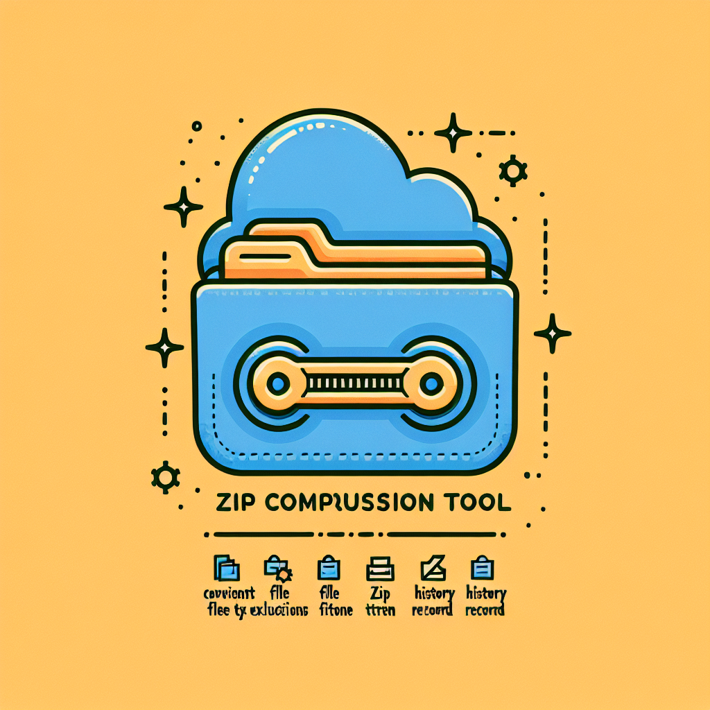

# Zip 打包工具

這是一個簡單易用的資料夾壓縮工具，可幫助您快速將資料夾打包成 zip 壓縮檔，並提供便捷的檔案類型排除和歷史記錄功能。

## 功能特色

- 圖形化介面，操作簡易
- 可選擇要打包的來源資料夾和目標 zip 檔案位置
- 支援設定排除特定檔案類型，預設會排除 .zip、.json 和 .config 檔案
- 保存打包歷史記錄，方便重複使用相同的打包設定
- 自動開啟檔案總管顯示打包完成的檔案位置

## 使用方式

1. 執行程式後，系統會提示您選擇要打包的來源資料夾
2. 如果此資料夾之前已經打包過，系統會詢問是否要套用先前的設定
3. 若選擇不使用先前設定，您可以:
   - 選擇新的壓縮檔儲存位置
   - 設定要排除的檔案類型 (以逗號分隔)
4. 完成設定後，系統會自動進行壓縮並在完成時開啟檔案總管

## 安裝方法

### 方法一：從原始碼執行

1. 確保您已安裝 Python 3
2. 複製此專案
3. 執行 `pip install -r requirements.txt`（若有需要）
4. 運行 `python zip_packer.py`

### 方法二：使用打包好的可執行檔

1. 從 Release 頁面下載最新的可執行檔
2. 直接點擊執行，無需安裝 Python 環境

## 系統需求

- Windows 作業系統
- Python 3.6+ (若從原始碼執行)

## 技術細節

- 使用 tkinter 建立圖形化介面
- 使用 zipfile 函式庫處理壓縮檔
- 使用 JSON 檔案儲存打包記錄

## 授權

此專案採用 MIT 授權條款